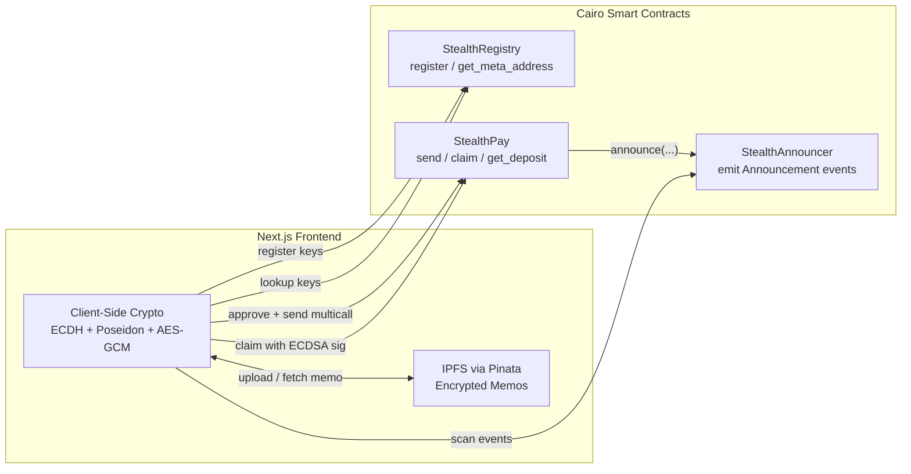
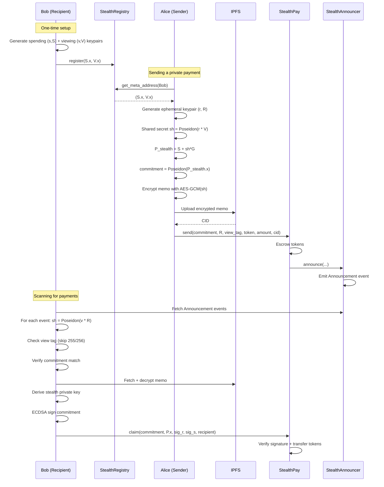
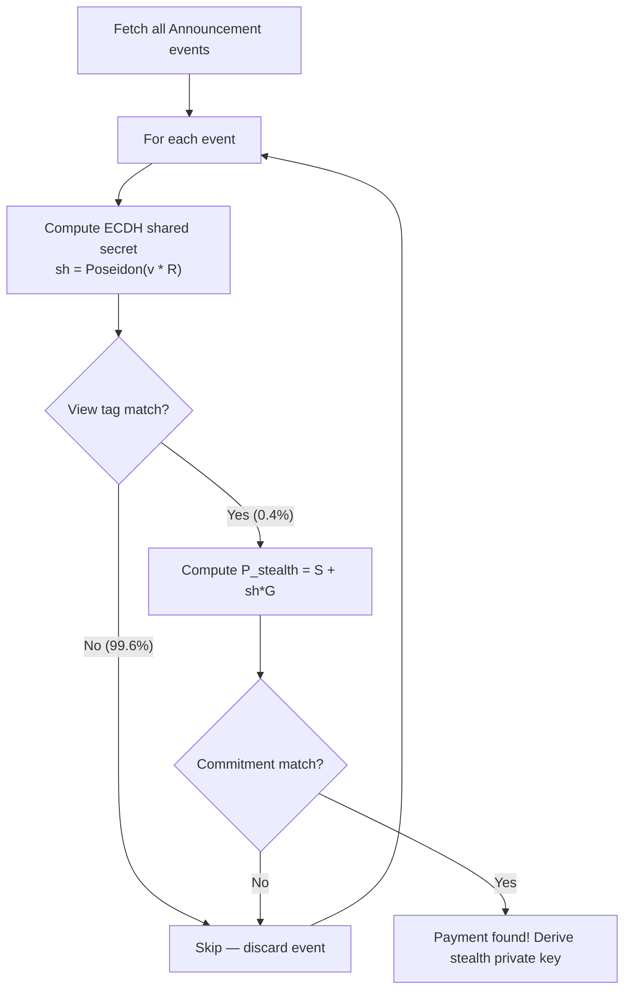

# StealthPay: Private Payments on Starknet

> **Send and receive tokens privately on Starknet using stealth addresses.** No one can link the sender to the recipient on-chain.


📄 **[Read the Whitepaper](WHITEPAPER.md)** — Full protocol design, cryptographic primitives, and security analysis.

## The Problem

Every transaction on Starknet is public. When Alice sends tokens to Bob, anyone can see:
- Alice's address sent X tokens
- Bob's address received X tokens
- The exact amount and token type

This complete transparency makes it impossible to receive payments privately. Salary payments, donations, business transactions, and personal transfers are all visible to the world.

## Our Solution

StealthPay implements the **ERC-5564 Stealth Address Protocol** natively on Starknet. It lets anyone send tokens to a recipient at a unique, one-time address that only the recipient can control. No on-chain link exists between the recipient's real address and the stealth address where funds land.

### How It Works (30-second version)

1. **Bob registers** his public keys on-chain (once)
2. **Alice sends** tokens to a freshly computed stealth address derived from Bob's public keys
3. **Bob scans** the chain with his private viewing key, finds the payment, and **claims** it to any wallet he wants

No one watching the chain can tell that Bob received the payment.

### The Missing Piece: IPFS Encrypted Memos

A hidden transaction is only half the battle. If a business pays a freelancer privately, the freelancer still needs to know *what* the payment was for. If Alice repays Bob for dinner, Bob needs context. 

Traditional blockchains force you to put transaction notes in public calldata, destroying privacy. 

**StealthPay solves this by combining Starknet with IPFS:**
When Alice sends a payment, she can attach a private memo. This memo is encrypted client-side using the AES-GCM standard, keyed by the exact same **shared secret** used to generate the stealth address. The encrypted ciphertext is then uploaded to IPFS.

Because the shared secret is mathematically impossible to derive without the recipient's private viewing key, **only the recipient can decrypt and read the attached IPFS memo.** The blockchain simply points to a decentralized IPFS CID containing encrypted gibberish to the rest of the world. 

### Architecture

StealthPay consists of three Cairo smart contracts and a Next.js frontend with client-side cryptography.

### Smart Contracts

| Contract | Purpose |
|----------|---------|
| **StealthRegistry** | Stores users' stealth meta-addresses (spending + viewing public keys) |
| **StealthAnnouncer** | Emits `Announcement` events with indexed view tags and IPFS CIDs |
| **StealthPay** | Handles deposits (send) and withdrawals (claim) with ECDSA signature verification |



### Protocol Flow



### O(1) Client-Side Execution via View Tags

* **The Mechanism:** To prevent the recipient's browser from crashing while scanning thousands of transactions, StealthPay implements a 1-byte "View Tag" derived from the ECDH shared secret.
* **The Privacy Guarantee:** When scanning the chain, the recipient computes the shared secret and extracts the view tag. If the tag doesn't match the one in the emitted event, the client immediately discards it. This eliminates the need to perform heavy Elliptic Curve point additions and Poseidon hashing for ~99.6% (255/256) of irrelevant transactions, ensuring the protocol remains lightweight and production-ready in a browser environment without leaking static identifiers.



## Tech Stack

| Layer | Technology |
|-------|-----------|
| Smart Contracts | Cairo 2 on Starknet |
| Frontend | Next.js 14 + TypeScript |
| Wallet Integration | starknet-react + starknet.js |
| Cryptography | STARK curve ECDH + Poseidon hashing (client-side) |
| Scaffold | Scaffold-Stark 2 |
| Styling | Tailwind CSS v3 + daisyUI v4 |

## Project Structure

```
StealthPay/
├── packages/
│   ├── snfoundry/                          # Cairo smart contracts & deployment
│   │   ├── contracts/src/
│   │   │   ├── stealth_registry.cairo      # Public key registration
│   │   │   ├── stealth_announcer.cairo     # Event emission for scanning
│   │   │   └── stealth_pay.cairo           # Deposit + claim logic
│   │   ├── contracts/tests/
│   │   │   └── test_registry.cairo         # Contract unit tests
│   │   ├── scripts-ts/
│   │   │   └── deploy.ts                   # Deployment script (deploys all 3 contracts)
│   │   └── .env                            # Deployer credentials (per-network)
│   └── nextjs/                             # Next.js frontend
│       ├── app/
│       │   ├── page.tsx                     # Landing page
│       │   ├── register/page.tsx            # Key generation + on-chain registration
│       │   ├── send/page.tsx                # Stealth address computation + token send
│       │   └── receive/page.tsx             # Scan announcements + claim payments
│       ├── hooks/stealth/
│       │   └── useStealthContracts.ts       # Custom hooks for contract interaction
│       ├── utils/stealth/
│       │   ├── crypto.ts                    # All cryptographic primitives
│       │   └── types.ts                     # TypeScript type definitions
│       ├── scaffold.config.ts               # Network target configuration
│       └── .env.local                       # RPC provider URLs
├── WHITEPAPER.md                            # Protocol design document
└── README.md                                # This file
```

## Getting Started

### Prerequisites

| Tool | Version | Installation |
|------|---------|-------------|
| **Node.js** | ≥ 18 | [nodejs.org](https://nodejs.org/) |
| **Yarn** | v1 or v2+ | `npm install -g yarn` |
| **Scarb** | **2.13.2** | [via starkup](https://docs.starknet.io/) |
| **Starknet Foundry** | Latest | [via starkup](https://docs.starknet.io/) |
| **Starknet Wallet** | - | [Argent X](https://www.argent.xyz/argent-x/) or [Braavos](https://braavos.app/) |

> **Scarb version matters.** The Sepolia sequencer uses Cairo 2.13.2 to compile Sierra to CASM. Using a different Scarb version locally will produce a different CASM hash, causing `Transaction execution error (code 41)` on deployment. Pin to **2.13.2** exactly.

To install Scarb and Starknet Foundry together:

```bash
curl https://get.starkup.dev | sh
```

### Clone & Install

```bash
git clone https://github.com/yourusername/StealthPay.git
cd StealthPay
yarn install
```

### Option A: Local Development (Devnet)

Run each command in a **separate terminal**:

```bash
# Terminal 1: Start local Starknet devnet
yarn chain

# Terminal 2: Compile and deploy contracts to devnet
yarn deploy

# Terminal 3: Start the Next.js frontend
yarn start
```

Open [http://localhost:3000](http://localhost:3000) and connect your wallet.

> **Note:** On devnet, the scaffold provides pre-funded burner wallets automatically.

### Option B: Sepolia Testnet

Standard scaffold deployment tools (`yarn deploy --network sepolia`) can struggle with CASM hash computation and v2/v3 transaction typing on testnets. StealthPay uses a **custom direct deployment script** that enforces v3 transactions (STRK for gas) and handles the sequential dependency injection of contract addresses.

#### 1. Configure the deployment script

Edit `deploy-sepolia-direct.ts` in the project root with your deployer credentials and a dedicated RPC endpoint (Alchemy or Infura recommended over public nodes).

#### 2. Fund your deployer wallet

Ensure your deployer wallet has **STRK** tokens. The script forces v3 transactions which use STRK for gas (not ETH).

#### 3. Deploy contracts

```bash
npx ts-node deploy-sepolia-direct.ts
```

The script deploys **StealthAnnouncer**, then **StealthRegistry**, then **StealthPay** in order, automatically passing the announcer address into the StealthPay constructor.

#### 4. Update deployed contract addresses

Copy the outputted contract addresses from the deploy script and update `packages/nextjs/contracts/deployedContracts.ts`.

#### 5. Configure the frontend

Create/edit `packages/nextjs/.env.local`:

```env
NEXT_PUBLIC_SEPOLIA_PROVIDER_URL=https://starknet-sepolia.g.alchemy.com/starknet/version/rpc/v0_9/YOUR_KEY
```

In `packages/nextjs/scaffold.config.ts`, ensure:

```typescript
targetNetworks: [chains.sepolia],
```

#### 6. Start the frontend

```bash
yarn start
```

### Running Tests

```bash
# Run Cairo contract tests
cd packages/snfoundry && snforge test

# Or from root
yarn test
```

## Usage

### 1. Register (Recipient, one-time setup)

Navigate to [`/register`](http://localhost:3000/register):

1. Click **"Generate Keys"**: creates your spending + viewing keypairs (stored locally in your browser's localStorage)
2. Click **"Register on Starknet"**: publishes the x-coordinates of your public keys to the on-chain `StealthRegistry`

### 2. Send (Sender)

Navigate to [`/send`](http://localhost:3000/send):

1. Enter the **recipient's Starknet address** (they must have registered)
2. Select a **token** (STRK or ETH)
3. Enter the **amount**
4. Click **"Send Privately"**

The app automatically:
- Looks up the recipient's registered public keys from the registry
- Computes a stealth address + ephemeral key client-side
- Executes a multicall that approves the token transfer and sends in one transaction

### 3. Receive (Recipient)

Navigate to [`/receive`](http://localhost:3000/receive):

1. Click **"Scan for Payments"**: scans on-chain `Announcement` events using your viewing key
2. Review the list of detected payments (amount, token, commitment)
3. Click **"Claim"** on any payment: signs a proof with the derived stealth private key and sends funds to your connected wallet

## Design Choices

StealthPay is built on Scaffold-Stark 2 but makes several intentional architectural decisions to support the stealth address protocol:

- **Custom contract hooks.** We use lightweight wrappers (`useStealthReadContract`, `useStealthWriteContract`) instead of the scaffold's generic hooks. Stealth contracts require runtime contract name resolution that bypasses the scaffold's compile-time type constraints, giving us more flexibility for dynamic contract interactions.
- **Raw RPC event scanning.** The Receive page fetches `Announcement` events directly via `RpcProvider.getEvents()` rather than scaffold event hooks. Stealth scanning requires custom parsing of raw event data followed by client-side ECDH cryptography on each event, a processing pipeline that doesn't fit the scaffold's event abstraction.
- **Direct multicall construction.** The Send page builds approve + send calls manually using `starknet.js` `Contract.populate()` and `useTransactor`, rather than the scaffold write hooks. This allows us to batch the ERC-20 approval and stealth payment into a single atomic multicall transaction.
- **Client-side cryptography.** All stealth address math (ECDH shared secrets, key derivation, ECDSA signing) runs entirely in the browser using `starknet.js` EC utilities. The Cairo contracts only verify proofs; they never touch private keys or perform complex EC operations.

## Privacy Model

### What StealthPay hides

- **Recipient identity.** The stealth commitment is cryptographically unlinkable to the recipient's registered address. No on-chain observer can determine who received a payment.
- **Payment relationship.** There is no visible connection between the sender's `send()` call and the recipient's `claim()` call. They reference different commitments and happen at different times from different addresses.
- **Claim destination.** The recipient can claim funds to any wallet, including a freshly generated one with no prior history.
- **Payment Context:** Any attached memos or invoices are AES-encrypted and stored on IPFS. Only the opaque CID is logged on-chain, keeping the context hidden from observers while remaining permanently accessible to the recipient.

### What StealthPay does NOT hide

- **Sender identity.** The sender's address is visible in the `send` transaction.
- **Payment amount and token type.** The deposit amount and ERC-20 token address are recorded on-chain in both the deposit struct and the `Announcement` event.
- **Timing.** Transaction timestamps are public.

### Amount correlation and mitigation

Because amounts are public, a statistical correlation attack is possible: if Alice deposits 42.698 STRK and a new wallet withdraws exactly 42.698 STRK a few hours later, an analyst can reasonably link those two transactions.

**Immediate mitigation: standardized denominations.** The established approach (used by protocols like Tornado Cash) is to send funds in fixed denominations (e.g. 10, 100, 1000 STRK). If ten users each deposit 100 STRK in a given period and ten users each withdraw 100 STRK, it becomes statistically infeasible to determine which deposit corresponds to which withdrawal. StealthPay supports this pattern today with no protocol changes.

**Roadmap: Pedersen commitments for amount hiding.** The natural next evolution is to integrate Pedersen commitment schemes into the deposit and claim flow. A Pedersen commitment `C = r*G + v*H` allows the contract to verify that the deposited amount matches the withdrawn amount *without ever revealing the actual value on-chain*. The sender would commit to the amount during `send()`, and the recipient would provide a zero-knowledge range proof during `claim()` demonstrating that the commitment opens to a valid, matching amount. This eliminates amount correlation entirely while preserving the contract's ability to enforce balance correctness. Starknet's native support for elliptic curve operations and Poseidon hashing makes this integration particularly efficient.

### Key security

- **Spending keys** never leave the browser. They are required to claim funds.
- **Viewing keys** can only detect payments, not spend them. Safe to delegate to a scanning service for passive monitoring.
- **ECDSA signatures** over the Poseidon commitment prove ownership of the stealth private key during claims.
- **No trusted third parties.** All cryptography runs client-side. Contracts only verify proofs.

## Deployed Contracts (Sepolia)

The project is live on the **Starknet Sepolia Testnet**. You can verify the contracts on any Starknet block explorer (like Voyager or StarkScan):

*   **StealthRegistry:** `0x395c85e22f637e87571b997176ee5e10c1150642091204407b07e25262b74a8`
*   **StealthAnnouncer:** `0x18da9e44c2f6a26e8972bde2e91eeda3ad9dad80bd7ac6817ec32a1b5c226d4`
*   **StealthPay:** `0x3746f0ba6ea4b9399c70cd6ff0feb8e16775366b7024c75ee2b02365bb6e9c3`

## Hackathon

Built for the **Starknet Re{define} Hackathon 2026**, Privacy + Bitcoin Track.

## Inspiration

- [EIP-5564: Stealth Addresses](https://eips.ethereum.org/EIPS/eip-5564)
- [Vitalik Buterin: An Incomplete Guide to Stealth Addresses](https://vitalik.eth.limo/general/2023/01/20/stealth.html)

## License

MIT
